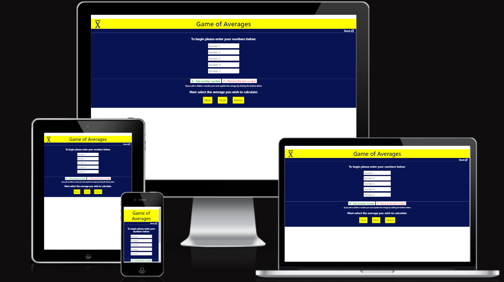

[GameofAverages Live Link](https://sophiebatten123.github.io/GameOfAverages/)

[GitHub Repository](https://github.com/sophiebatten123/GameOfAverages)

# Game of Averages

(Developer: Sophie Batten)

The Game of Averages is coded using HTML, CSS and JavaScript. The game allows uses to input values including integers, decimals and negative numbers, select the average they wish to calculate and for the correct answer to appear on the screen. This educational resource is easy to navigate and has been tested via manual user tests.